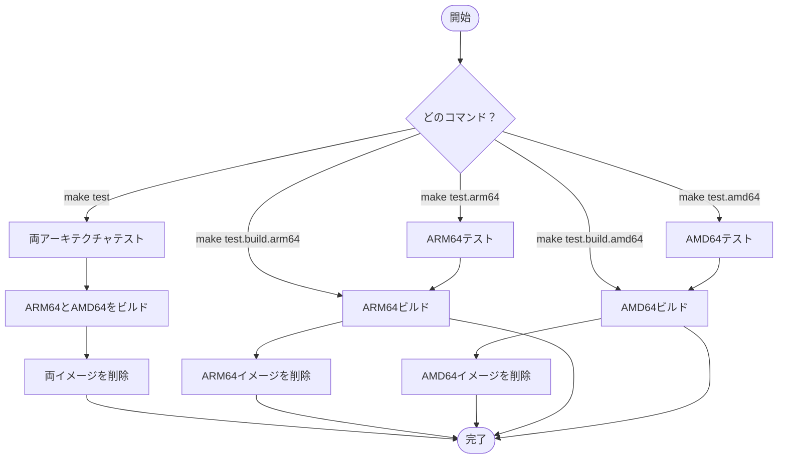
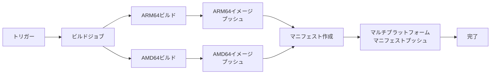
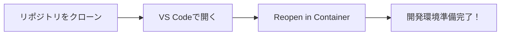

# dot-devcontainer-terraform-1.14

[](https://github.com/bearfield/dot-devcontainer-terraform-1.14/actions/workflows/terraform-1.14.yaml)

Terraform 1.14開発環境用のDockerコンテナプロジェクトです。VS Code Dev Container対応で、すぐに開発を始められます。

## 概要

このプロジェクトは、Terraform 1.14を使用したインフラストラクチャ・アズ・コード（IaC）の開発環境を提供するDockerコンテナを構築します。Fish shellを搭載したDebianベースのコンテナに、Terraform、tflint、trivyがインストールされています。

## 特徴

### クロスプラットフォーム対応
- ARM64 (Apple Silicon, AWS Graviton)
- AMD64 (Intel/AMD)

### 開発者向け機能
- VS Code Dev Container完全対応
- Fish shellによる快適なターミナル環境
- Docker-outside-of-docker機能
- Git、SSH、GCloud認証情報の自動マウント

### セキュリティ
- trivyによる脆弱性スキャン
- 最小権限のDebianベースイメージ
- 定期的な自動ビルドによる最新セキュリティパッチ適用

## 含まれるツール

| ツール | バージョン | 用途 |
|--------|------------|------|
| Terraform | 1.14.* | インフラストラクチャ・アズ・コード（IaC）ツール |
| tflint | 最新版 | Terraformコードのリンター |
| trivy | 最新版 | セキュリティスキャナー |
| Fish shell | 最新版 | ユーザーフレンドリーなコマンドラインシェル |
| Docker CLI | 最新版 | コンテナ操作（Docker-outside-of-docker経由） |

## ビルドフロー



## ビルドコマンド詳細

### 全アーキテクチャテスト
```bash
make test
```
ARM64とAMD64の両方をビルドし、完了後に自動的にクリーンアップします。

### 個別アーキテクチャテスト
```bash
# ARM64のみ
make test.arm64

# AMD64のみ
make test.amd64
```

### ビルドのみ（クリーンアップなし）
```bash
# ARM64
make test.build.arm64

# AMD64
make test.build.amd64
```

### 手動クリーンアップ
```bash
# ARM64イメージ削除
make test.rmi.arm64

# AMD64イメージ削除
make test.rmi.amd64
```

## CI/CD

このプロジェクトはGitHub Actionsを使用して自動ビルドを行います。

### 自動ビルドトリガー
- mainブランチへのプッシュ時（dockerディレクトリまたはワークフローファイル変更時のみ）
- 毎日19:00 UTC（日本時間4:00）

### 並列ビルドアーキテクチャ


この並列アプローチにより、ビルド時間が約半分に短縮されます。

## クイックスタート

### VS Code Dev Container（推奨）
このプロジェクトは[VS Code Dev Containers](https://code.visualstudio.com/docs/devcontainers/containers)を完全サポートしています。



1. **リポジトリのクローン**
   ```bash
   git clone https://github.com/bearfield/dot-devcontainer-terraform-1.14.git
   cd dot-devcontainer-terraform-1.14
   ```

2. **VS Codeで開く**
   ```bash
   code .
   ```

3. **Dev Containerで再オープン**
   - コマンドパレット（Cmd/Ctrl + Shift + P）を開く
   - 「Dev Containers: Reopen in Container」を選択
   - 自動的にコンテナがビルド・起動されます

### 手動でDockerコンテナを使用
```bash
# プレビルドイメージをpull
docker pull ghcr.io/bearfield/terraform:1.14

# コンテナを起動
docker run -it --rm \
  -v $(pwd):/workspace \
  -v $HOME/.gitconfig:/home/vscode/.gitconfig:ro \
  -v $HOME/.ssh:/home/vscode/.ssh:ro \
  ghcr.io/bearfield/terraform:1.14 \
  fish
```

## VS Code Dev Container機能詳細

### 自動設定される拡張機能
- **HashiCorp Terraform**: Terraform言語サポート
- **HashiCorp HCL**: HCL構文ハイライト
- **Docker**: Dockerfileサポート
- **Makefile Tools**: Makefileサポート
- その他開発効率化ツール

### 自動マウントされる設定
| ローカルパス | コンテナ内パス | 用途 |
|-------------|---------------|------|
| ~/devcontainer_conf/.gitconfig_linux | /home/${USER}/.gitconfig | Git設定 |
| ~/.ssh | /home/${USER}/.ssh | SSH鍵 |
| ~/.config/gcloud | /home/${USER}/.config/gcloud | GCloud認証 |
| ~/.claude | /home/${USER}/.claude | Claude設定 |

### エディタ設定
- 保存時の自動フォーマット（Terraform）
- Fish shellがデフォルトターミナル
- タイムゾーン: Asia/Tokyo
- 事前設定されたTerraform拡張機能とLinter

## コンテナ情報

### イメージタグ
| タグ | 説明 | 更新頻度 |
|-----|------|----------|
| `ghcr.io/bearfield/terraform:1.14` | 最新のマルチプラットフォームイメージ | 毎日自動ビルド |
| `ghcr.io/bearfield/terraform:1.14-YYYYMMDD` | 日付付きバージョン | 毎日 |
| `ghcr.io/bearfield/terraform:1.14-arm64` | ARM64専用 | 毎日 |
| `ghcr.io/bearfield/terraform:1.14-amd64` | AMD64専用 | 毎日 |

### 技術仕様
- **ベースイメージ**: `ghcr.io/bearfield/debian-fish:bookworm`
- **OS**: Debian 12 (Bookworm)
- **シェル**: Fish shell
- **ユーザー**: ${USER} (UID: 1000)

## トラブルシューティング

### Dev Containerが起動しない場合
1. Docker Desktopが起動していることを確認
2. VS Code Dev Containers拡張機能がインストールされていることを確認
3. `docker pull ghcr.io/bearfield/terraform:1.14` でイメージを手動で取得

### Terraformコマンドが見つからない場合
コンテナ内で以下を実行：
```bash
which terraform
terraform version
```

### 権限エラーが発生する場合
マウントされたファイルの権限を確認：
```bash
ls -la ~/.ssh
ls -la ~/.gitconfig
```

## 関連プロジェクト
- [dot-devcontainer-debian-fish-bookworm](https://github.com/bearfield/dot-devcontainer-debian-fish-bookworm) - ベースとなるDebian + Fish環境
- [Terraform公式ドキュメント](https://www.terraform.io/docs) - Terraformの使い方

## ライセンス
このプロジェクトのライセンスについては、[LICENSE](LICENSE)ファイルを参照してください。
